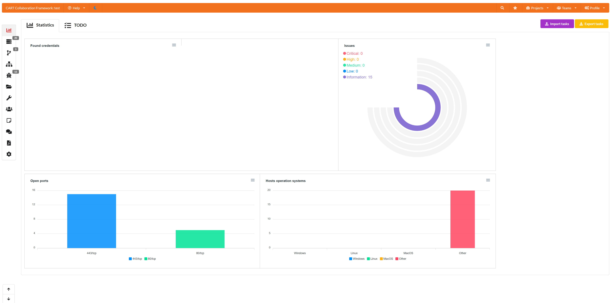

# CART Collaboration Framework

<b>CART Collaboration Framework - an opensource, cross-platform and portable toolkit for automating routine processes
when carrying out various works for testing!</b>
 

## 🛠 Supported tools

| **Tool name**                                                                                                                  | Integration type | Description                                                                                             |
|--------------------------------------------------------------------------------------------------------------------------------|------------------|---------------------------------------------------------------------------------------------------------|
| Nmap                                                                                                                           | Import           | Import XML results (ip, port, service type, service version, hostnames, os). Supported plugins: vulners |
| Nessus                                                                                                                         | Import           | Import .nessus results (ip, port, service type, security issues, os)                                    |
| Qualys                                                                                                                         | Import           | Import .xml results (ip, port, service type, security issues)                                           |
| Masscan                                                                                                                        | Import           | Import XML results (ip, port)                                                                           |
| Nikto                                                                                                                          | Import           | Import XML, CSV, JSON results (issue, ip, port)                                                         |
| Acunetix                                                                                                                       | Import           | Import XML results (ip, port, issue)                                                                    |
| Burp Suite Enterprise                                                                                                          | Import           | Import HTML results (ip, port, hostname, issue, poc)                                                    |
| kube-hunter                                                                                                                    | Import           | Import JSON result (ip, port, service, issue)                                                           |
| Checkmarx SAST                                                                                                                 | Import           | Import XML/CSV results (code info, issue)                                                               |
| Dependency-check                                                                                                               | Import           | Import XML results (code issues)                                                                        |
| OpenVAS/GVM                                                                                                                    | Import           | Import XML results (ip, port, hostname, issue)                                                          |
| NetSparker                                                                                                                     | Import           | Import XML results (ip, port, hostname, issue)                                                          |
| BurpSuite | Import/Extention | Extention for fast issue send from burpsuite.                                                           |
| ipwhois                                                                                                                        | Scan             | Scan hosts(s)/network(s) and save whois data                                                            |
| shodan                                                                                                                         | Scan             | Scan hosts ang save info (ip, port, service).                                                           |
| HTTP-Sniffer                                                                                                                   | Additional       | Create multiple http-sniffers for any project.                                                          |
| WPScan                                                                                                                         | Import           | Import JSON results (ip, port, hostname, issue)                                                         |
| DNSrecon                                                                                                                       | Import           | Import JSON/CSV/XML results (ip, port, hostname)                                                        |
| theHarvester                                                                                                                   | Import           | Import XML results (ip, hostname)                                                                       |
| Metasploit                                                                                                                     | Import           | Import XML project (ip, port, hostname, issue)                                                          |
| Nuclei                                                                                                                         | Import           | Import JSON results (ip, hostname, port, issue)                                                         |
| PingCastle                                                                                                                     | Import           | Import XML results (ip, issue)                                                                          |
| MaxPatrol                                                                                                                      | Import           | Import XML results (ip, port, issue)                                                                    |
| Scanvus                                                                                                                        | Import           | Import JSON report (issue)                                                                              |
| Tenable.sc                                                                                                                     | Import           | Import .nessus results (ip, port, service type, security issues, os)                                    |
| aiodnsbrute                                                                                                                    | Import           | Import JSON/CSV results (ip, hostname)                                                                  |
| Advanced Port Scanner                                                                                                          | Import           | Import XML results (ip, hostname, port)                                                                 |
| RedCheck                                                                                                                       | Import           | Import CSV results (ip, port, security issues)                                                          |

